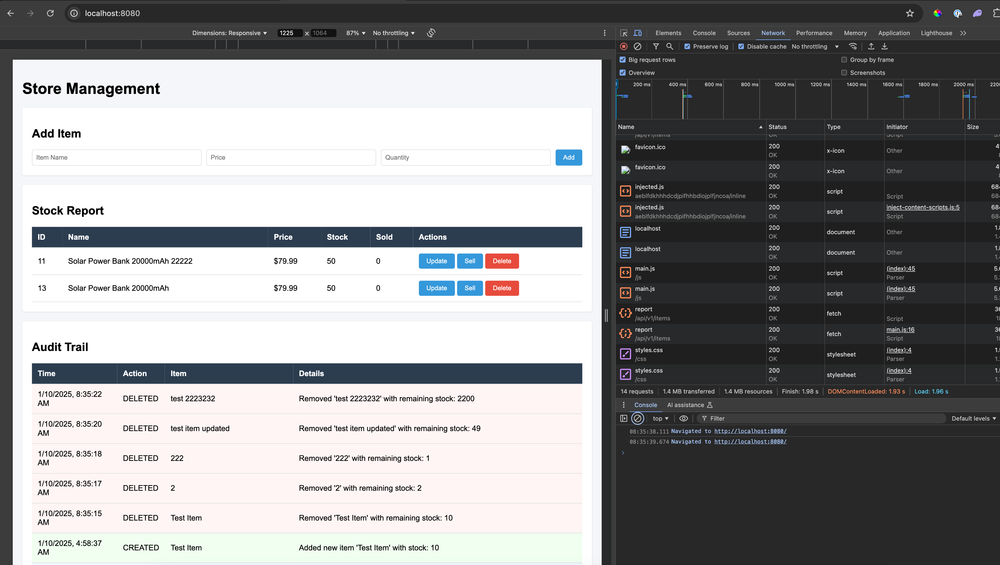

# Store Management System



A RESTful store management application designed to simplify inventory tracking, enhance operational visibility, and provide a robust audit trail. Built with modern tools and technologies, the application ensures scalability, maintainability, and reliability.

## Features

- **Inventory Management**: Add, update, delete, and sell items in stock.
- **Real-time Event Tracking**: Kafka-powered messaging for item transactions.
- **Comprehensive Reporting**: Generate stock reports and audit logs.
- **RESTful API**: Intuitive API for seamless integration.
- **Audit Trail**: Detailed history of all inventory operations.

## Technology Stack

- **Language**: Java 17+
- **Framework**: Spring Boot 3.x
- **Database**: PostgreSQL
- **Messaging**: Apache Kafka
- **Containerization**: Docker & Docker Compose
- **Testing**: JUnit, Mockito
- **Build Tool**: Gradle

## Getting Started

### Prerequisites

Ensure you have the following installed:

- Docker and Docker Compose
- Java 17+
- Gradle or Maven

### Setup Instructions

1. **Clone the Repository**:
   ```bash
   git clone https://github.com/danteteder/store-home-task/
   ```

2. **Start Infrastructure**:
   Spin up PostgreSQL and Kafka using Docker Compose:
   ```bash
   docker-compose up -d
   ```

3. **Run the Application**:
   Use Gradle to build the application:

   ```bash
   ./gradlew build
   ```

   Then to run the application:
   ```bash
   ./gradlew bootRun
   ```

4. **Access the API**:
   The API will be available at:
   ```
   http://localhost:8080
   ```

5. **API Documentation**:
   Explore detailed API documentation via Swagger:
   ```
   http://localhost:8080/swagger-ui.html
   ```

## API Endpoints Overview

- **Create Item**: `POST /api/v1/items`

- **Update Item**: `PUT /api/v1/items/{id}`

- **Delete Item**: `DELETE /api/v1/items/{id}`

- **Sell Item**: `POST /api/v1/items/sell/{id}?quantity=5`

- **Get Stock Report**: `GET /api/v1/items/report`

- **Get Audit Trail**: `GET /api/v1/items/audit`

## Architecture

This project adheres to clean architecture principles:

- **Controllers**: Handle HTTP requests and responses.
- **Services**: Contain business logic.
- **Repositories**: Manage data access.
- **Kafka Integration**: Handle messaging for item transactions.
- **Auditing**: Tracks all operations and maintains historical records.

## Testing

Run all tests to ensure functionality and code quality:
 ```bash
./gradlew test
```

## Code Quality

The project follows best practices:

- **SOLID Principles**: Ensure maintainable and scalable code.
- **KISS and DRY Principles**: Keep the code simple and avoid redundancy.
- **Javadoc Documentation**: Every method and class is thoroughly documented.
- **Logging**: Detailed logs for debugging and monitoring.
- **Error Handling**: Graceful handling of exceptions.

## Logging

Logs are stored in `logs/store-application.log` with detailed patterns for both file and console outputs.

## Potential Future Improvements

### Code Quality
- Replace string constants with enums for event types (CREATED, UPDATED, SOLD)
- Implement DTOs to separate API contracts from domain models
- Add custom exceptions for better error handling (e.g., InsufficientStockException)

### Project Structure
- Reorganize into a clearer project structure
- Create dedicated config package for all configurations
- Add constants folder for shared values
- Enhance resource organization (static files, templates)

### Testing
- Add further testing, as well as potential edge-cases
- Add integration tests for Kafka event flow
- Implement test coverage for database transactions
- Add performance tests for concurrent operations

### UI/UX Enhancements
- Implement responsive design for mobile compatibility
- Add real-time updates using WebSocket
- Improve form validations and error feedback
- Add sorting and filtering to stock report
- Implement pagination for large datasets
- Add data visualization for sales trends etc
- Enhance accessibility features

### Monitoring & Logging
- Enhance logging with structured format
- Add request tracing for better debugging
- Improve audit trail visualization

### Configuration
- Move sensitive data to environment variables
- Externalize Kafka and database configurations
- Add application profiles for different environments

### Documentation
- Add API response examples
- Include system architecture diagram
- Document error scenarios and handling
